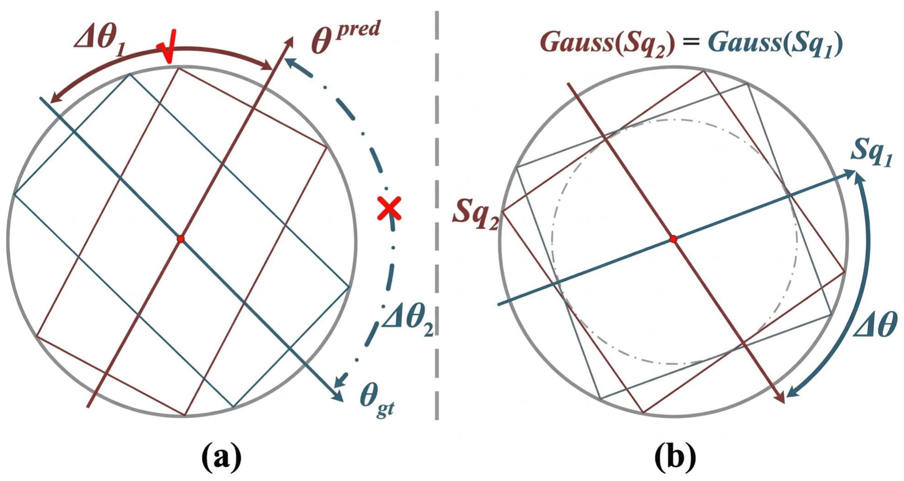
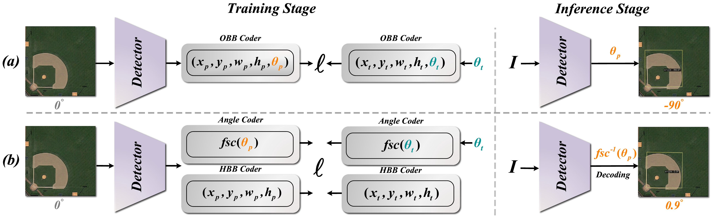

# Fourier Series Coder

Official MMRotate implementation of **Fourier Series Coder: A Novel Perspective
on Angle Boundary Discontinuity Problem for Oriented Object Detection**.

This repository is based on [MMRotate dev-1.x](https://github.com/open-mmlab/mmrotate/tree/dev-1.x)
and releases the core FSC method code, a DOTA training configuration, and
project assets for reproducible oriented object detection experiments.

<div align="center">
  
</div>

## News

- **2026-06-25**: Released the MMRotate-based FSC codebase with the core method
  implementation and a DOTA training configuration.
- FSC weights for **HRSC-2016** and **DOTA-v1.0** will be released soon.

## Abstract

With the rapid advancement of intelligent driving and remote sensing, oriented
object detection has gained widespread attention. However, achieving
high-precision performance is fundamentally constrained by the Angle Boundary
Discontinuity (ABD) and Cyclic Ambiguity (CA) problems, which typically cause
significant angle fluctuations near periodic boundaries. Although recent studies
propose continuous angle coders to alleviate these issues, our theoretical and
empirical analyses reveal that state-of-the-art methods still suffer from
substantial cyclic errors. We attribute this instability to the structural noise
amplification within their non-orthogonal decoding mechanisms. This mathematical
vulnerability significantly exacerbates angular deviations, particularly for
square-like objects. To resolve this fundamentally, we propose the Fourier
Series Coder (FSC), a lightweight plug-and-play component that establishes a
continuous, reversible, and mathematically robust angle encoding-decoding
paradigm. By rigorously mapping angles onto a minimal orthogonal Fourier basis
and explicitly enforcing a geometric manifold constraint, FSC effectively
prevents feature modulus collapse. This structurally stabilized representation
ensures highly robust phase unwrapping, intrinsically eliminating the need for
heuristic truncations while achieving strict boundary continuity and superior
noise immunity. Extensive experiments across three large-scale datasets
demonstrate that FSC achieves highly competitive overall performance, yielding
substantial improvements in high-precision detection.

## Method

<div align="center">
  
</div>

The upper row shows the conventional OBB regression paradigm, where angle and
box parameters are optimized jointly. The lower row shows FSC. During training,
the target angle is encoded into Fourier components by `FSTCoder`, and the
detector learns the continuous angular representation with a dedicated Fourier
loss. During inference, the predicted Fourier components are decoded back to the
oriented-box angle.

Core files:

- `mmrotate/models/task_modules/coders/fst_coder.py`: Fourier-series angle
  encoder and decoder.
- `mmrotate/models/dense_heads/fourier_series_retina_head.py`: RetinaNet angle
  head with Fourier supervision and manifold regularization.
- `configs/fsc-retinanet-r50_fpn_3x_dota.py`: FSC-RetinaNet R-50-FPN training
  config for DOTA-v1.0.

## Installation

Follow the standard MMRotate 1.x installation workflow:

```bash
conda create -n fsc python=3.8 -y
conda activate fsc
pip install -U openmim
mim install mmengine
mim install "mmcv>=2.0.0rc2"
mim install "mmdet>=3.0.0rc5"
pip install -v -e .
```

Please refer to the original
[MMRotate 1.x documentation](https://mmrotate.readthedocs.io/en/1.x/) for
environment details, dataset preparation, and evaluation tools.

## Dataset

Prepare DOTA-v1.0 in the standard MMRotate layout:

```text
data/split_ss_dota/
  trainval/
    images/
    annfiles/
  test/
    images/
```

The released config uses the official MMRotate DOTA dataset base file:
`configs/_base_/datasets/dota.py`.

## Training

Train FSC-RetinaNet on DOTA-v1.0:

```bash
python tools/train.py configs/fsc-retinanet-r50_fpn_3x_dota.py
```

Multi-GPU training:

```bash
bash tools/dist_train.sh configs/fsc-retinanet-r50_fpn_3x_dota.py 8
```

## Evaluation

Single-GPU testing:

```bash
python tools/test.py \
  configs/fsc-retinanet-r50_fpn_3x_dota.py \
  ${CHECKPOINT_PATH}
```

For DOTA server submission, use MMRotate's standard DOTA merge and submission
pipeline after inference.

## Model Zoo

| Method | Backbone | Dataset | Config | Weights |
| --- | --- | --- | --- | --- |
| FSC-RetinaNet | R-50-FPN | DOTA-v1.0 | `configs/fsc-retinanet-r50_fpn_3x_dota.py` | Coming soon |
| FSC-RetinaNet | R-50-FPN | HRSC-2016 | Coming soon | Coming soon |

## Code Scope

This open-source branch intentionally contains the complete MMRotate framework
plus the minimal FSC method implementation needed to train and evaluate the
released configuration. Private experiment scripts, local visualization tools,
temporary analysis files, and machine-specific paths are not included.

## Citation

If FSC is useful for your research, please cite:

```bibtex
@article{wei2026fourier,
  title={Fourier Series Coder: A Novel Perspective on Angle Boundary Discontinuity Problem for Oriented Object Detection},
  author={Wei, Minghong and Cao, Pu and Chen, Zhihao and Zang, Zhiyuan and Yang, Lu and Song, Qing},
  journal={arXiv preprint arXiv:2604.20281},
  year={2026}
}
```

## Acknowledgement

This implementation is built on top of
[MMRotate](https://github.com/open-mmlab/mmrotate). We thank the OpenMMLab
community for the rotated object detection codebase.
